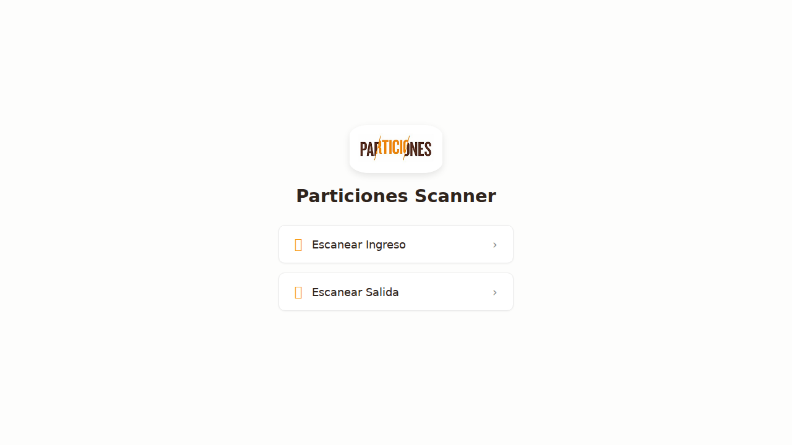
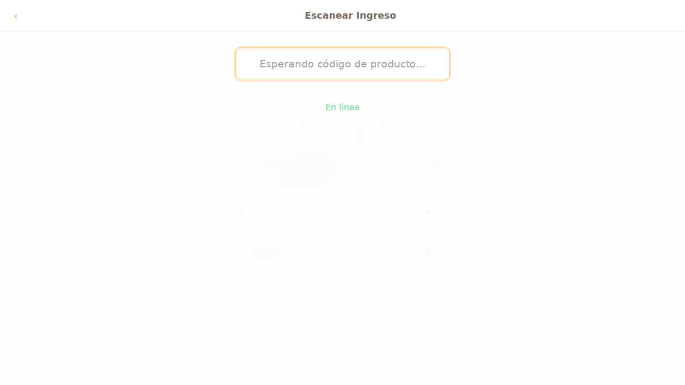
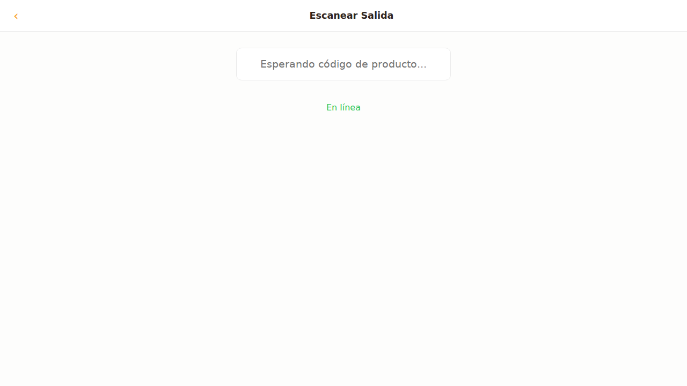

# Instructivo de Uso - Particiones Scanner

Esta guía explica cómo utilizar la aplicación Particiones Scanner para registrar el ingreso y salida de productos.

## 1. Pantalla de Inicio

Al abrir la aplicación, verás el menú principal. Desde aquí puedes elegir qué tipo de escaneo quieres realizar.

- **Escanear Ingreso:** Selecciona esta opción cuando estés registrando productos que entran al inventario.
- **Escanear Salida:** Selecciona esta opción para los productos que salen del inventario.

## 2. Escanear un Producto

### Ingreso de Productos

1. Pulsa el botón **Escanear Ingreso**.
2. La pantalla cambiará al modo de escaneo de ingreso.
3. El campo de texto se activará automáticamente para que puedas usar tu escáner de mano.
4. Apunta con tu escáner al código de barras del producto. El código aparecerá en la pantalla y se enviará automáticamente.

- **Confirmación:** Si el envío es exitoso, verás el mensaje "Enviado" en color verde.
- **Modo sin conexión:** Si no tienes internet, los datos se guardarán en el dispositivo y se enviarán automáticamente cuando recuperes la conexión. Verás un mensaje indicando cuántos escaneos tienes pendientes.

### Salida de Productos

El proceso es idéntico al de ingreso:

1. Vuelve al menú principal pulsando el botón **‹** en la esquina superior izquierda.
2. Pulsa el botón **Escanear Salida**.
3. Escanea el código de barras del producto que sale.

## 3. Estado de la Conexión

La aplicación te informa sobre el estado de tu conexión y la sincronización de datos:

- **En línea:** (Color verde) Conexión estable.
- **Enviando...:** (Color naranja) Enviando un código escaneado.
- **Sin conexión:** (Color gris) No hay conexión a internet. Los escaneos se están guardando localmente.
- **Sincronizando...:** (Color naranja) Enviando los datos que tenías guardados mientras no tenías conexión.
- **Error de conexión:** (Color rojo) Hubo un problema al enviar los datos. La aplicación reintentará más tarde.

## 4. Notas Importantes

- **No refresques la página:** La aplicación guarda los datos en la memoria del navegador. Si refrescas, podrías perder los escaneos pendientes.
- **Mantén la pantalla activa:** La aplicación evita que la pantalla de tu dispositivo se apague mientras estás en la pantalla de escaneo para facilitar el trabajo continuo.
